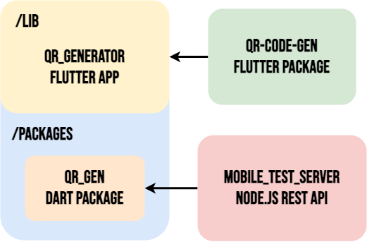
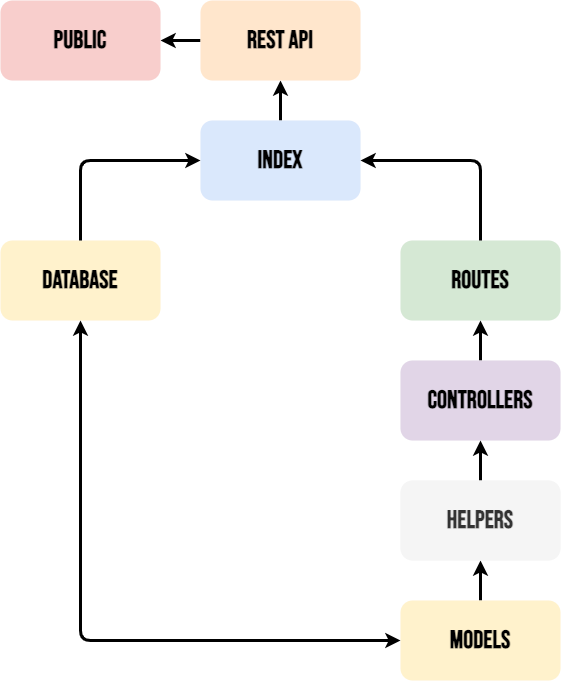

# mobile-test-server

A simple seed API that 

## Context

- A client needs to display a QR code in their App.
- The QR code can be used to identify one's profile or a certain feature.

### Modules



- qr_generator: Flutter app where the Presentation layer is located. Has a `/packages` folder with every feature's Domain and Data layers.
- qr_gen: Dart package located in `qr_generator` packages. Encapsulates the functionality to get seed from API.
- qr_code_gen: Flutter package I made some time ago to encapsulate logic and ensure testability of the QR generation functionality.
- mobile_test_server: Node.js Rest API that has the `/seed` endpoint to get a seed object.

## How to run the project

Before running, you have to configure the `.env` file. If you don't have it, ask the project maintainer for it and include it in the project's root.

```sh
npm install
npm start
```

or

```sh
npm install
npm run start:dev
```

if you want to react to changes on the fly, without having to put down the API.

## API



- Index: Contains all the base script to run the server.
- Database: Contains the neccessary methods to create a database connection with minimal MongoDB configuration. Database is hosted on a MongoDB cluster via MongoAtlas and Google Cloud.
- Routes: Contains the endpoints for the API and their router.
- Controllers: Makes a response based on the result of an actual implementation in `helpers`.
- Helpers: Implements specific functionality for the API.
- Models: Reflect data objects, commonly database schemas to perform operations to database.

### Structure


### Format

(in Open API 3.0 format)

```yaml
paths:
  /seed:
    get:
      description: Get a seed that can be used to generate a QR code
      responses:
        '200':
          description: seed generated
          content:
            application/json:
              schema:
                $ref: '#/components/schemas/Seed'
components:
  schemas:
    Seed:
      type: object
      properties:
        seed:
          type: string
          example: d43397d129c3de9e4b6c3974c1c16d1f
        expires_at:
          type: dateTime
          description: ISO date-time
          example: '1979-11-12T13:10:42.24Z'
```

## Tech stack

- API
  - Node.js
  - Express
  - MongoDB
- Mobile app
  - Flutter
